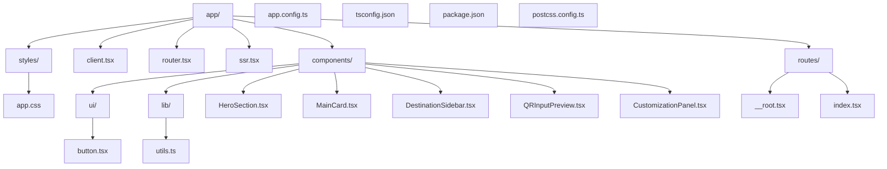
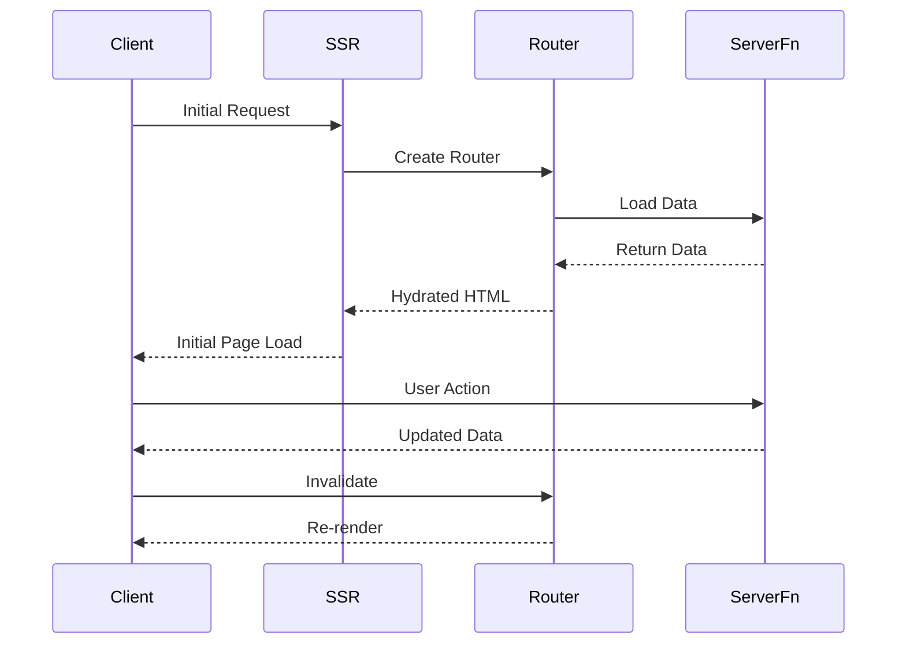

# QR Generator Start

A modern web application built with TanStack Start, featuring server-side rendering and file-based routing.

## Architecture

The application follows a modern React architecture using TanStack Start, which provides a powerful combination of server-side rendering and client-side hydration.

### Directory Structure



### Application Flow



## Key Components

### 1. Static UI Scaffold (2024 Redesign)

The main page now features a static, modern UI scaffold:

- **HeroSection**: Top hero area with headline, subheadline, and call-to-action buttons. (`app/components/HeroSection.tsx`)
- **MainCard**: Main card container with three columns. (`app/components/MainCard.tsx`)
  - **DestinationSidebar**: Vertical list of destination types. (`app/components/DestinationSidebar.tsx`)
  - **QRInputPreview**: URL input and QR code preview. (`app/components/QRInputPreview.tsx`)
  - **CustomizationPanel**: Pattern, color, and theme selectors. (`app/components/CustomizationPanel.tsx`)

All components are styled with Tailwind CSS and follow Shadcn UI best practices. No functionality is implemented yet—this is a look-and-feel scaffold only.

### 2. Server-Side Rendering (SSR)

- Entry point: `app/ssr.tsx`
- Handles initial server-side rendering
- Integrates with TanStack Router for route management

### 3. Client-Side Hydration

- Entry point: `app/client.tsx`
- Hydrates the server-rendered HTML
- Initializes client-side routing

### 4. Routing

- File-based routing system
- Root layout: `app/routes/__root.tsx`
- Index route: `app/routes/index.tsx`
- Router configuration: `app/router.tsx`

## Styling & UI Components

This project uses **Tailwind CSS** for utility-first styling, with a custom theme defined in `app/styles/app.css`. The setup also includes:

- [shadcn/ui](https://ui.shadcn.com/) Button component (see `app/components/ui/button.tsx`)
- Utility function for class name merging in `app/lib/utils.ts`
- [class-variance-authority](https://cva.style/), [clsx](https://github.com/lukeed/clsx), and [tailwind-merge](https://tailwind-merge.vercel.app/) for advanced class management
- [Radix UI Slot](https://www.radix-ui.com/primitives/docs/components/slot) for polymorphic components
- [Lucide React](https://lucide.dev/) for icons (future use)

### Adding Styles

- Global styles and theme variables are in `app/styles/app.css` (imported in the root layout).
- Use Tailwind utility classes in your components for rapid styling.
- For custom UI elements, use or extend the components in `app/components/ui/`.

### Example: Using the Button Component

```tsx
import { Button } from "@/components/ui/button";

<Button variant="outline" size="lg">
  Click me
</Button>;
```

## Features

- Static UI scaffold for QR generator (2024 redesign)
- Server-side rendering
- File-based routing
- Type-safe server functions
- Hot module replacement
- Production-ready build system

## Development

```bash
# Install dependencies (now includes Tailwind, shadcn/ui, etc.)
npm install

# Start development server
npm run dev

# Build for production
npm run build

# Start production server
npm start
```

## Technology Stack

- **Framework**: TanStack Start
- **Routing**: TanStack Router
- **Language**: TypeScript
- **Styling**: Tailwind CSS, shadcn/ui, class-variance-authority, clsx, tailwind-merge
- **UI Primitives**: Radix UI, Lucide React
- **Build Tool**: Vinxi
- **Runtime**: Node.js
