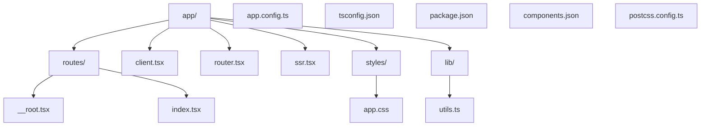
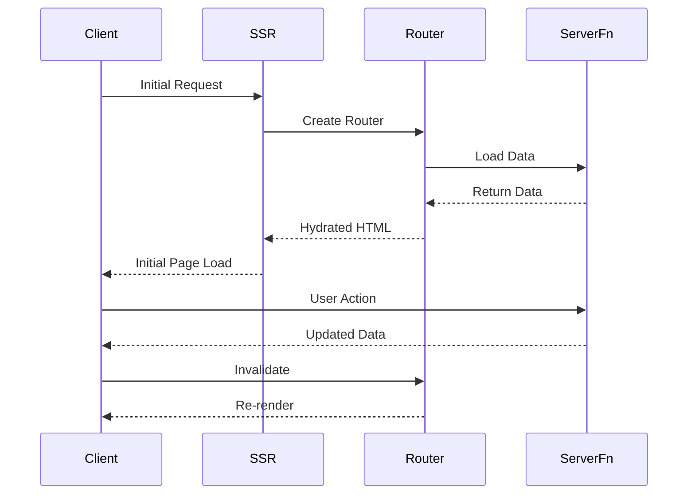

# QR Generator Start

A modern web application built with TanStack Start, featuring server-side rendering and file-based routing.

## Architecture

The application follows a modern React architecture using TanStack Start, which provides a powerful combination of server-side rendering and client-side hydration.

### Directory Structure



### Application Flow



## Key Components

### 1. Server-Side Rendering (SSR)

- Entry point: `app/ssr.tsx`
- Handles initial server-side rendering
- Integrates with TanStack Router for route management

### 2. Client-Side Hydration

- Entry point: `app/client.tsx`
- Hydrates the server-rendered HTML
- Initializes client-side routing
- Imports global styles with Tailwind CSS

### 3. Routing

- File-based routing system
- Root layout: `app/routes/__root.tsx`
- Index route: `app/routes/index.tsx`
- Router configuration: `app/router.tsx`

### 4. Server Functions

- Implemented using `createServerFn`
- Example: Counter functionality in index route
- Handles file system operations

### 5. Styling

- shadcn/ui components for consistent UI
- Tailwind CSS for utility-first styling
- Global styles in `app/styles/app.css`
- PostCSS processing with `@tailwindcss/postcss`
- Utility functions in `app/lib/utils.ts`
- Customizable theme configuration in `components.json`

## Development

```bash
# Install dependencies
npm install

# Start development server
npm run dev

# Build for production
npm run build

# Start production server
npm start
```

## Technology Stack

- **Framework**: TanStack Start
- **Routing**: TanStack Router
- **Language**: TypeScript
- **Build Tool**: Vinxi
- **Runtime**: Node.js
- **UI Components**: shadcn/ui
- **Styling**: Tailwind CSS
- **CSS Processing**: PostCSS

## Features

- Server-side rendering
- File-based routing
- Type-safe server functions
- Hot module replacement
- Production-ready build system
- Modern UI components with shadcn/ui
- Utility-first CSS with Tailwind
- Responsive design support
- Modern CSS processing pipeline
